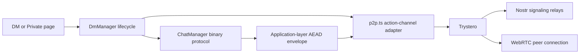
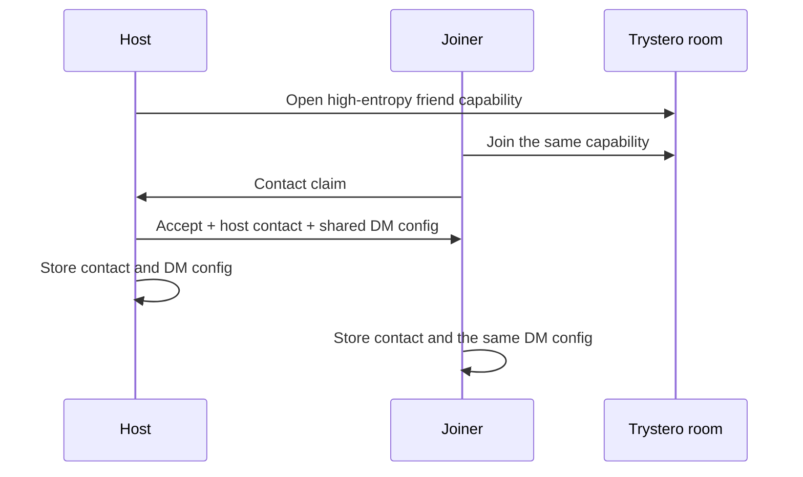

# holi-user — Architecture

Holi User is the local vault and peer-to-peer collaboration client in the Holi monorepo. It is a static Astro application: user data stays in browser storage or in a directory explicitly authorized through the File System Access API.

## Product boundaries

- `/[lang]/` opens, restores, and manages a local vault.
- `/[lang]/friend` completes a capability-based friend handshake.
- `/[lang]/dm` opens the persistent encrypted conversation stored for a contact.
- `/[lang]/private` creates or joins a link-based encrypted conversation without requiring a contact.
- `/[lang]/vault` opens project collaboration from a project capability link.

The two conversation routes intentionally share the same `DmManager` and `ChatManager`. Pages own presentation and history; protocol classes own connection, encryption, heartbeats, and file framing.

## Networking layers

- Trystero's Nostr strategy performs discovery and WebRTC signaling. Relays never receive chat messages or files.
- DM signaling rooms use the shared DM key as Trystero's password.
- `ChatManager` additionally encrypts every DM message, heartbeat, and file frame at the application layer with the 32-byte DM key.
- Relay defaults belong to Trystero. Holi only overrides them when an environment or local diagnostic setting explicitly requests it.

## Friend handshake

A friend code is a high-entropy capability. Both peers exchange contact claims and converge on one shared DM configuration; the host's configuration is authoritative so the two contacts cannot accidentally store different rooms.

The current handshake proves possession of the invitation capability; it does not cryptographically prove a human-readable alias. Users should confirm identity through another channel when that distinction matters.

Related modules:

- `src/lib/friends/friend-handshake.ts`
- `src/components/vault/modals/FriendModal.astro`

## Direct messages

`DmManager` is the only DM connection lifecycle. It cancels stale attempts, retries with bounded exponential backoff, closes resources on navigation, and creates one encrypted `ChatManager` after a peer appears. Both `/dm` and `/private` use this path.

Related modules:

- `src/lib/friends/dm-manager.ts`
- `src/lib/friends/p2p.ts`
- `src/lib/p2p/chat.ts`
- `src/lib/p2p/trystero-client.ts`

## Project collaboration

Projects use a separate multi-peer manager. A high-entropy project secret derives the room identifier and also password-protects Trystero signaling. Project messages and files travel directly over WebRTC's encrypted transport.

Project actions do not yet use the DM binary AEAD envelope. Do not describe project collaboration as application-layer encrypted until that protocol is added. The capability link grants project access; rotating the project key is required for meaningful revocation.

Related modules:

- `src/lib/p2p/trystero-vault.ts`
- `src/lib/vault/controller.ts`

## Storage ownership

- Contact data and DM history are stored under `.holi/` in an authorized vault.
- Link-based private chat falls back to browser `localStorage` when no vault is open.
- Project files are read and written only inside the active authorized vault.
- `ChatManager` never writes to storage. It emits received blobs and lets the page or project controller decide whether to download or persist them.

## Security rules

- Never log friend codes, DM keys, project secrets, derived room IDs, message bodies, or raw signaling events.
- Treat URL fragments containing capabilities as secrets. They are intentionally kept out of normal HTTP requests.
- A block prevents future local interaction; it does not erase data already shared.
- Rotate a DM or project key when access must be revoked.
- Keep debug output redacted and disabled in production.

See `ENV.md` for supported network diagnostics.
