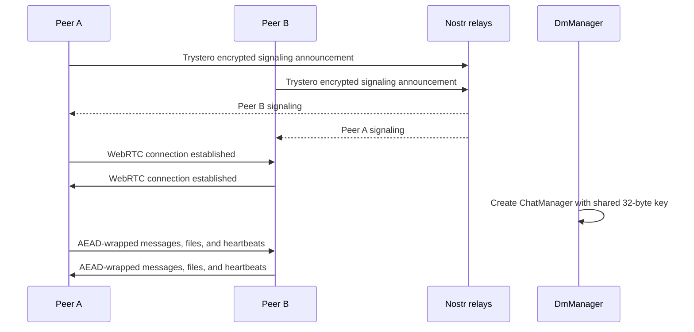
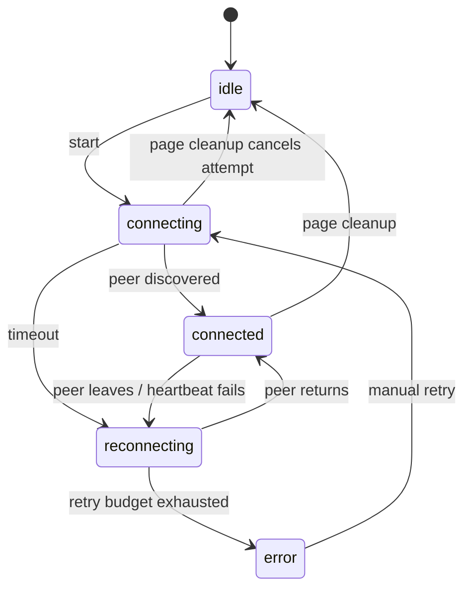

# Holi P2P architecture

## Direct-message path

Nostr is discovery and signaling only. It does not carry application messages or files.

## Responsibilities

| Module                  | Responsibility                                                               |
| ----------------------- | ---------------------------------------------------------------------------- |
| `trystero-client.ts`    | Adapts the current Trystero API and applies explicit relay/ICE overrides.    |
| `friends/p2p.ts`        | Exposes Trystero actions as the channel surface used by the binary protocol. |
| `friends/dm-manager.ts` | Owns connect, cancel, retry, heartbeat lifecycle, and cleanup.               |
| `p2p/chat.ts`           | Owns ordered binary framing, application encryption, and file transfer.      |
| `/dm` and `/private`    | Render state and decide how history/files are persisted.                     |

## State transitions

## Project path

Project collaboration is separate because it is multi-peer and synchronizes manifests, metadata, and files. Its capability secret derives the room and protects Trystero signaling. Payloads travel over WebRTC's encrypted transport; they do not yet use the DM application envelope.
